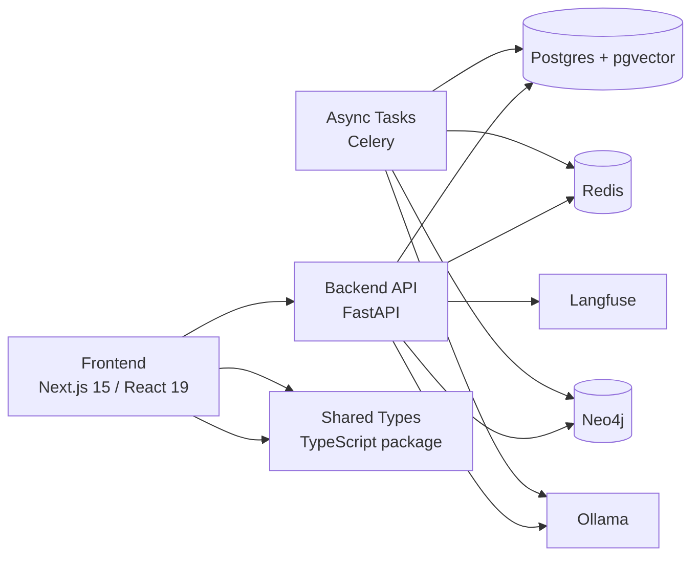

# Architecture

## Goal

Phase 1 establishes the monorepo, developer workflows, and containerized local stack for MitoNexus.
Application features, business logic, and production schemas are intentionally out of scope.

## High-Level Diagram

## Repository Layout

- `apps/backend`: FastAPI service, Alembic config, test harness, and Python tooling.
- `apps/frontend`: Next.js application shell, UI foundations, and frontend tooling.
- `packages/shared-types`: Cross-workspace TypeScript contracts.
- `infrastructure/docker`: Service bootstrap assets for local containers.
- `infrastructure/scripts`: Developer convenience scripts for the local stack.
- `docs`: Living documentation for architecture, setup, and API conventions.

## Phase 1 Decisions

- The backend exposes only a minimal `/health` endpoint.
- The frontend is a visual shell only, with no product features implemented.
- Docker Compose focuses on local development and integration smoke checks.
- CI is split by backend and frontend concerns to keep feedback loops targeted.
