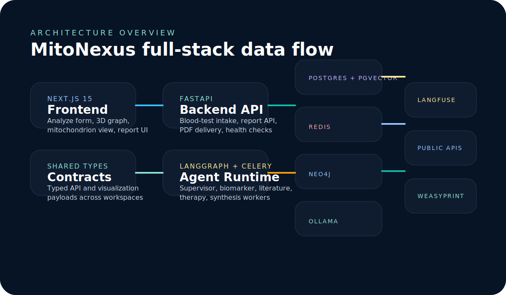

# Architecture

## System Overview

MitoNexus is a monorepo AI/ML platform for personalized mitochondrial health analysis. The stack is
built around a typed contract shared across a Next.js 15 frontend and a FastAPI backend, with
LangGraph agents orchestrated in Celery workers for durable long-running analysis jobs.

## Runtime Flow

1. The frontend collects a blood panel and submits it to `POST /api/v1/blood-test/analyze`.
2. FastAPI persists the patient, raw markers, derived markers, and a pending `AnalysisReport`.
3. Celery dispatches the LangGraph workflow.
4. Specialist agents perform biomarker interpretation, literature retrieval, therapy reasoning, and
   final synthesis.
5. The synthesis step stores:
   - `mitoscore` and component scores
   - therapy plan payload
   - knowledge-graph visualization data
   - mitochondrion overlay data
   - a generated PDF report
6. The frontend reads the report API and renders:
   - report overview
   - 3D knowledge graph
   - 3D mitochondrion overlay
   - PDF download

## Major Components

- Frontend: Next.js 15, React 19, TanStack Query, React Three Fiber, Drei, `three-forcegraph`
- Backend API: FastAPI, Pydantic v2, SQLAlchemy 2 async, Alembic
- Agent orchestration: LangGraph v1.0, Celery worker + Beat, Ollama-hosted local models
- Storage:
  - Postgres for primary relational state
  - pgvector for literature embeddings
  - Neo4j for graph relationships
  - Redis for Celery broker/result backend
- Observability: Langfuse traces for workflow runs
- Reporting: Jinja2 + WeasyPrint

## Data Boundaries

- `packages/shared-types`: frontend-safe API and visualization contracts
- `apps/backend/src/mitonexus/data/markers.json`: canonical marker catalog
- `AnalysisReport.therapy_plan`: report-centric serialized reasoning payload
- `AnalysisReport.visualization_data`: typed graph + mitochondrion payload consumed by the UI

## Security Notes

- SQL access is routed through SQLAlchemy and parameterized expressions.
- Neo4j queries use bound parameters instead of string interpolation.
- Jinja2 report rendering runs with HTML autoescaping enabled.
- Runtime configuration is sourced from environment variables rather than hard-coded secrets.
- CORS configuration is explicit and environment-driven.
